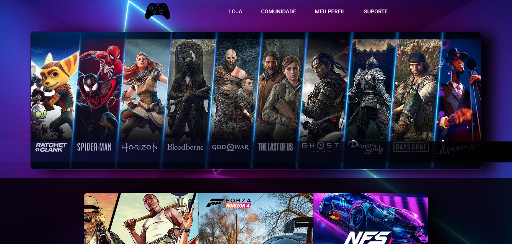
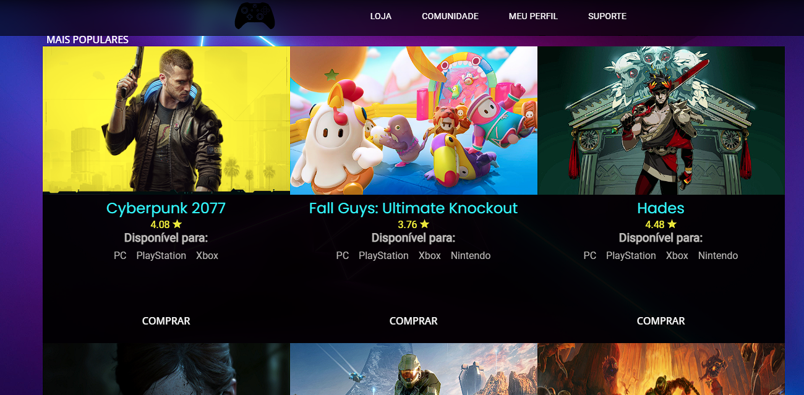

<h1 align="center">Game Store 🎮</h1>

 <a href="#sobre">Sobre</a> •
 <a href="#tecnologias">Tecnologias</a> • 
 <a href="#autor">Autor</a> 

# Sobre

Projeto de uma webStore de jogos baseada usando a API RAWG Video Games Database API

# Tecnologias

• HTML 

• CSS

• JavaScript

# Aplicação do JavaScritp

Link da api  <a href="https://rawg.io/apidocs">https://rawg.io/apidocs</a>

# API em funcionamento

# Autor

Dev: João Marcos Melo

E-mail: jmmsp2003@hotmail.com

Tel:(75)98827-5212 (whatsapp)

<h4 align="center"> 
	🚧  Game Store 🚀 Em construção...  🚧
</h4>
